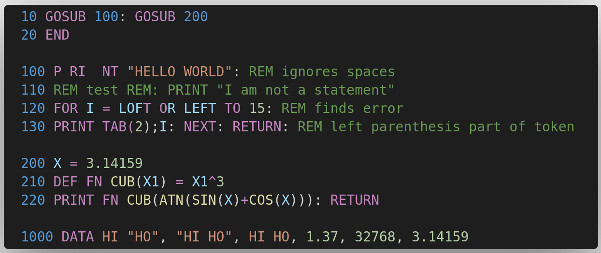
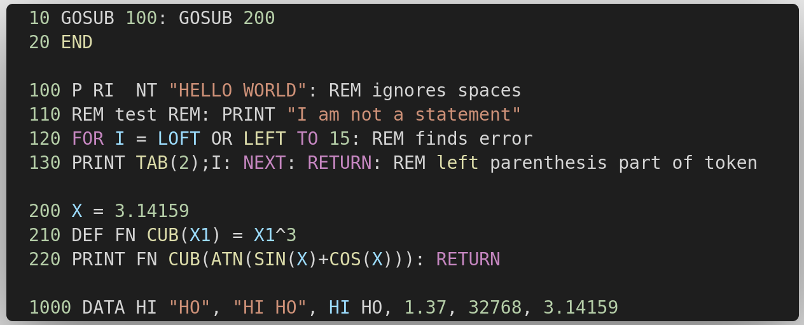

# language-applesoft
Syntax recognition for Applesoft BASIC in Visual Studio Code.

Emulates behaviors of the Apple II ROM.

If you are viewing this on github, you can install the extension from VS Code by searching the Marketplace for `applesoft`.

This extension uses semantic highlighting.  Here is an example:

Contrast with Visual BASIC highlights of the same file:

If you are interested in parsing Applesoft BASIC see [tree-sitter-applesoft](https://github.com/dfgordon/tree-sitter-applesoft).
