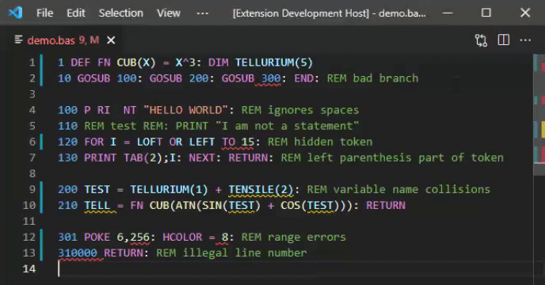

# Applesoft BASIC

Language support for Applesoft BASIC in Visual Studio Code.

*latest features*: outline, symbol operations, minify command

* Semantic highlights true to Apple //e ROM parsing
* Comprehensive completions and hovers
* Management of variables, functions, and line numbers
* Diagnostics to identify errors and gotchas
* Transfer programs to and from Apple ][ emulators (see below)
* View tokenized program as hex dump and unicode text
* Options : see `Ctrl+Comma` -> `Extensions` -> `Applesoft BASIC`
* Commands: see `Ctrl+P` -> `applesoft`
* Activates for file extensions `.bas`, `.abas`, `.A`

## Line Numbers

The extension will treat line numbers as document symbols if they are branch destinations.  You can treat these line numbers just as if they were, say, function names in a modern language.  For example, if `GOSUB 100` is found in the document, right-clicking on any reference to line 100 allows you to apply symbol manipulations such as `goto references` and `goto definition`.  The line number and the text of any comment on the line will appear in the document outline.  On the other hand, `rename symbol` cannot be used with line numbers.  Instead, use the `renumber lines` command if you want to renumber.

## Managing Variables

Applesoft variables and function names have the property that only the first two characters are significant, e.g., `CUTE` and `CUBE` are the same variable.  By default, the extension will underline colliding variable names with a warning squiggle.  In every other respect, the extension will treat colliding variable names as distinct, e.g., using `goto references` on `CUTE` will not find references to `CUBE`.  The assumption here is that colliding variable names are bugs or potential bugs.

You can use `rename symbol` to quickly change the names of variables or functions.

Variables and functions only appear in the symbol outline where they are assigned, defined, or dimensioned.

## Declarations and Definitions

The `DIM` statement is the only item we recognize as a declaration.  Using `goto declaration` on an array reference will find all the places in the file where it is dimensioned.

Using `goto definition` on a variable will find all the places in the file where it is assigned (as of this writing it does not find input sources like `INPUT` or `READ`).

Using `goto definition` on a function will find the function definition.

Using `goto definition` on a line number reference will find the line.

## Multi-File Programs and Program Flow

As of this writing, the extension analyzes each file in isolation.  This is why, e.g., undimensioned array references trigger a warning rather than an error (the array might be dimensioned in another file).  Also as of this writing, the extension does not try to follow the program's flow.  As a result, errors such as `NEXT WITHOUT FOR`, `REDIM'D ARRAY`, etc., are not detected.

## Minify and Tokenize

The extension provides a `minify` command to reduce the memory used by your Applesoft program.  This performs the following transformations on your code:

* Strips all comments
* Reduces all variable and function names to the first two characters
* Strips unnecessary separators and unquotes

This produces a new document, leaving the existing one unchanged.  Make sure you review and repair all variable name collisions before applying this transformation.

As of this writing, `minify` does not include renumbering lines.  This has to be done separately using the `renumber lines` command.

If you want to see how much space you have saved, you can use the `show tokenized program` command on the transformed and untransformed code. Note the ending addresses in the two cases.

## Apple ][ Special Addresses

The extension knows hundreds of special address locations relevant to Applesoft, DOS 3.3, ProDOS, and the Apple ][ ROM.  Hovering over a literal address argument of `CALL`, `PEEK`, or `POKE` will display information about any address in the database.  Completions for special addresses are triggered when the `space` key is pressed following `CALL`, `PEEK`, or `POKE`.  A convenient way to do this is to select the snippet with the `special` annotation, and then immediately press `space`.

## Using with AppleWin

You can transfer programs to and from [AppleWin](https://github.com/AppleWin/AppleWin).  One way is to use the emulator's own clipboard functions.  The extension also provides the following save state interactions:

* To transfer a program to [AppleWin](https://github.com/AppleWin/AppleWin), first use [AppleWin](https://github.com/AppleWin/AppleWin) to create a state file (press `F11`).  Then in the editor use `Ctrl-P` to select `applesoft: Store program in AppleWin save state`, and select the state file.  Then go to [AppleWin](https://github.com/AppleWin/AppleWin) and press `F12` to load the modified state file.  Type `LIST` to verify success.
	- Any program or variables already in the state file are lost.
	- The state file used for this should be a "safe state," e.g., machine awaiting line entry.
	- Start of program space (103,104) and `HIMEM` are retained, `LOMEM` is reset.  If the program would break `HIMEM` the operation is aborted.
* To transfer a program from [AppleWin](https://github.com/AppleWin/AppleWin), make sure the program is in the emulated machine's memory, and create a state file by pressing `F11`.  Once you have the state file, return to the editor, position the cursor at the insertion point, and use `Ctrl-P` to select `applesoft: Insert program from AppleWin save state`.  Select the state file and the program should be inserted.

Operations with the state file are the same on any platform, but [AppleWin](https://github.com/AppleWin/AppleWin) itself is native to Windows.  Note that [AppleWin](https://github.com/AppleWin/AppleWin) is not part of the extension, and must be installed separately.

## Using with Virtual ][

You can transfer programs to and from the [Virtual \]\ emulator.  One way is to use the emulator's own clipboard functions.  The extension also provides the following commands (`Cmd+P`):

* `applesoft: Enter in Virtual ][ new machine`: creates a new virtual machine, resets it, and enters the program.  Since this resets the machine while it is waiting for a disk to be inserted, there are no operating system commands available.  This is suitable for self-contained programs.
* `applesoft: Run in Virtual ][ new machine`: same as above, except the program is also run in the same step.
* `applesoft: Enter in Virtual ][ front machine`: attempts to enter program into the machine in the front window.  This allows you to configure the machine any way you like, but is more dangerous, since we cannot know what the machine is doing at the moment you give the command.  Existing program and variables are erased.
* `applesoft: Run in Virtual ][ front machine`: same as above, except the program is also run in the same step.
* `applesoft: Insert program from Virtual ][ front machine`: extracts the Applesoft program currently in the memory of the virtual machine, and inserts it at the position of the cursor or selection.

This capability only applies to MacOS. Note that [Virtual \]\ is not part of the extension, and must be installed separately.