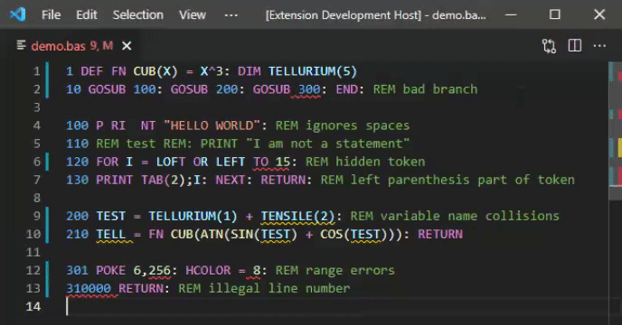

# Applesoft BASIC

Language support for Applesoft BASIC in Visual Studio Code.

If you are viewing this on github, you can install the extension from VS Code by searching the Marketplace for `applesoft`.

* Semantic highlights true to Apple //e ROM parsing
* Completions and hovers for all statements
* Completions and hovers for soft switches, ROM routines, etc.
* Diagnostics to identify errors and gotchas
* Renumber lines in a selection or full document
* Transfer programs to and from Apple ][ emulators (see below)
* Options : see `Ctrl+Comma` -> `Extensions` -> `Applesoft BASIC`
* Commands: see `Ctrl+P` -> `applesoft`
* Activates for file extensions `.bas`, `.abas`, `.A`

## Apple ][ Special Addresses

The extension knows over 180 special address locations relevant to Applesoft, DOS 3.3, ProDOS, and the Apple ][ ROM.  Hovering over a literal address argument of `CALL`, `PEEK`, or `POKE` will display information about any address in the database.  Completions for special addresses are triggered when the `space` key is pressed following `CALL`, `PEEK`, or `POKE`.  A convenient way to do this is to select the snippet with the `special` annotation, and then immediately press `space`.

## Using with AppleWin

The extension can transfer programs from the [AppleWin](https://github.com/AppleWin/AppleWin) emulator.  To do this, first load the code in [AppleWin](https://github.com/AppleWin/AppleWin) and create a state file by pressing `F11`.  Once you have the state file, return to the editor, position the cursor at the insertion point, and use `Ctrl-P` to select `applesoft: Insert program from AppleWin save state`.  Select the state file and the program should be inserted.

Reading the state file works the same on any platform, but [AppleWin](https://github.com/AppleWin/AppleWin) itself is native to Windows.  Note that [AppleWin](https://github.com/AppleWin/AppleWin) is not part of the extension, and must be installed separately.

## Using with Virtual ][

The extension can transfer programs to and from the [Virtual \]\ emulator.  To do this, use one of the `Ctrl+P` commands:

* `applesoft: Enter in Virtual ][ new machine`: creates a new virtual machine, resets it, and enters the code.  Since this resets the machine while it is waiting for a disk to be inserted, there are no operating system commands available.  This is suitable for self-contained programs.
* `applesoft: Run in Virtual ][ new machine`: same as above, except the code is also run in the same step.
* `applesoft: Enter in Virtual ][ front machine`: attempts to enter code into the machine in the front window.  This allows you to configure the machine any way you like, but is more dangerous, since we cannot know what the machine is doing at the moment you give the command.  Existing program and variables are erased.
* `applesoft: Run in Virtual ][ front machine`: same as above, except the code is also run in the same step.
* `applesoft: Insert program from Virtual ][ front machine`: extracts the Applesoft program currently in the memory of the virtual machine, and inserts it at the position of the cursor or selection.

This capability only applies to MacOS. Note that [Virtual \]\ is not part of the extension, and must be installed separately.